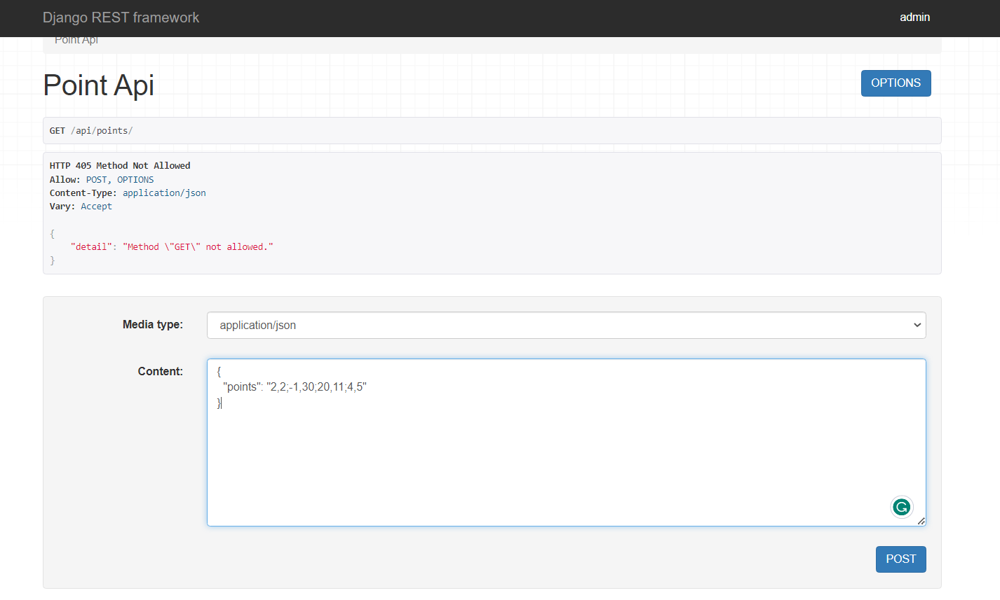
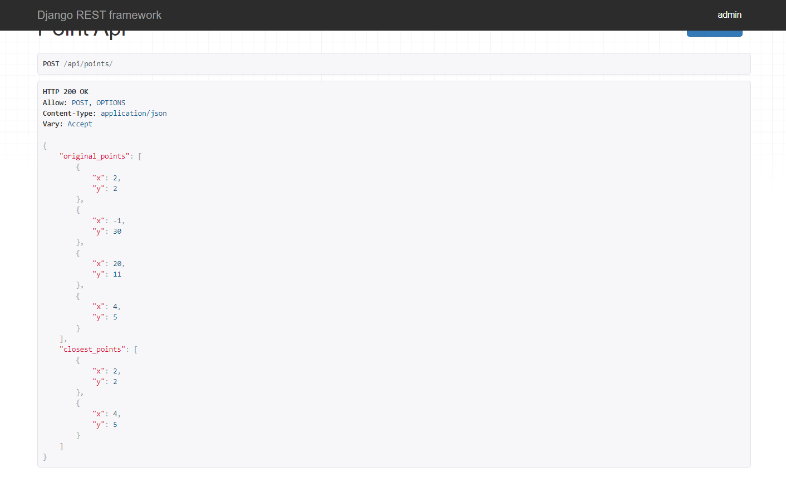

# Closest Point App

A Django application with an API that receives a set of points, finds the points that are closest to each other, stores the received set of points along with their closest points in a database, and includes unit tests

  

  

## Technologies

- Python
- Django
- Django Rest Framework
- Sqlite

## Setup

- Clone the project: `git@github.com:rOluochKe/closestPointApi.git`
- Change directory into : `cd /closestPointApi`
- Create your environment and install dependencies: `pip install -r requirements.txt`
- Run migrations: `python manage.py makemigrations && python manage.py migrate`
- Create super user: `python manage.py createsuperuser`
- Navigation to admin dashboard: `http://localhost:8000/admin` login create and view points and closest points
- Run tests: `python manage.py test`
- View api on: `http://localhost:8000/api/points/`
- Post example data points: `{"points": "2,2;-1,30;20,11;4,5"}`
